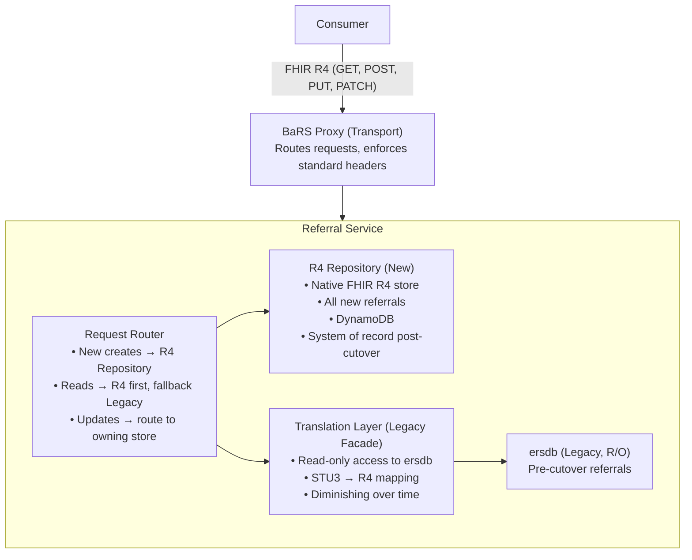
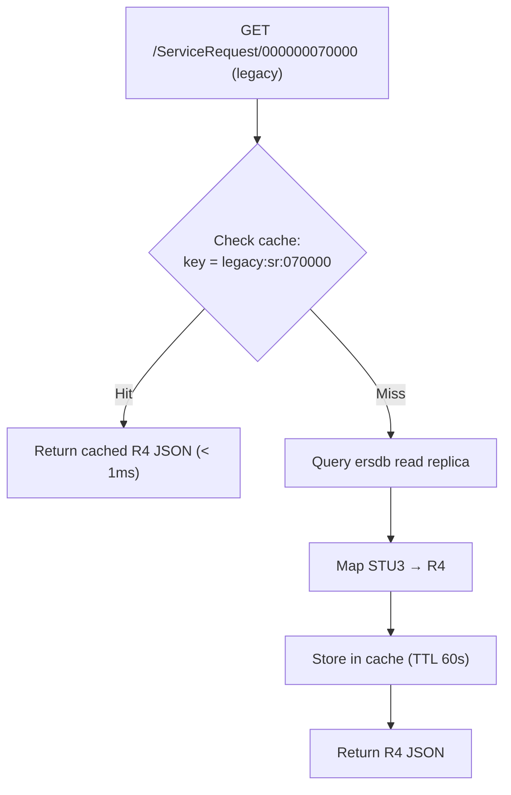
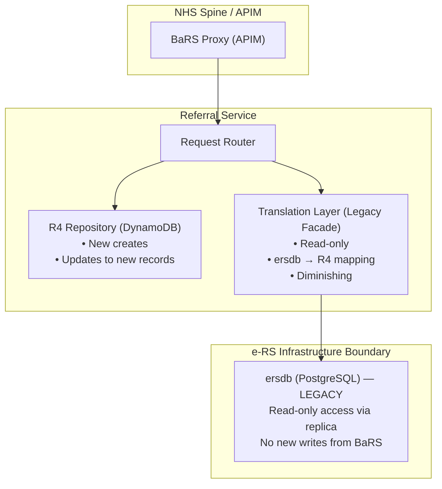

# e-RS to BaRS /ServiceRequest Translation Layer

## Purpose

This document details the design of the Referral Service — a new FHIR R4-native data store for all new ServiceRequests — and a translation layer that provides read-only access to legacy referrals in the e-RS database (`ersdb`).

New referrals created via `POST /ServiceRequest` are stored natively as FHIR R4 in the **new R4 Repository**. The legacy `ersdb` is accessed only for reading pre-existing referrals that have not yet reached a terminal state. Over time, the translation layer handles a diminishing volume as legacy referrals complete or are cancelled, and the R4 Repository becomes the sole data store.

This is complementary to the strategic analysis in [worklists-vs-service-requests.md](./worklists-vs-service-requests.md) — that document covers *why*; this document covers *how*.

---

## Architecture Overview



### Data Ownership

| Component | Owns | Access Mode | Lifespan |
|---|---|---|---|
| **R4 Repository** | All new referrals (post-cutover) | Read/Write | Permanent — the strategic store |
| **ersdb** | All legacy referrals (pre-cutover) | Read-only (via Translation Layer) | Diminishing — retired when all legacy referrals reach terminal state |
| **Translation Layer** | Nothing — it is a facade | Read-only query + mapping | Temporary — retired with ersdb |

---

## Supported API Operations

The Referral Service exposes the following FHIR R4 operations. Write operations target the **R4 Repository**. Read operations query both stores and merge results.

| Operation | HTTP | Path | Target Store | Purpose |
|-----------|------|------|---|---------|
| **Search** | `GET` | `/ServiceRequest` | R4 Repository + Legacy (merged) | Retrieve referrals by patient, performer, status, date |
| **Read** | `GET` | `/ServiceRequest/{id}` | R4 Repository first, fallback to Legacy | Retrieve a single referral by logical ID |
| **Create** | `POST` | `/ServiceRequest` | **R4 Repository only** | Create a new referral (never writes to ersdb) |
| **Update** | `PUT` | `/ServiceRequest/{id}` | R4 Repository (new) or Legacy via facade (existing) | Full update of an existing referral |
| **Patch** | `PATCH` | `/ServiceRequest/{id}` | R4 Repository (new) or Legacy via facade (existing) | Partial update (e.g. status change, triage outcome) |

### Search Parameters

| Parameter | Type | FHIR Path | ersdb Column(s) | Example |
|-----------|------|-----------|-----------------|---------|
| `_id` | token | `ServiceRequest.id` | `referral.ubrn` | `_id=000000070000` |
| `patient:identifier` | token | `ServiceRequest.subject.identifier` | `patient.nhs_number` | `patient:identifier=https://fhir.nhs.uk/Id/nhs-number\|9876543210` |
| `performer:identifier` | token | `ServiceRequest.performer.identifier` | `service.ods_code` | `performer:identifier=https://fhir.nhs.uk/Id/ods-organization-code\|R69` |
| `requester:identifier` | token | `ServiceRequest.requester.identifier` | `referral.referrer_ods_code` | `requester:identifier=https://fhir.nhs.uk/Id/ods-organization-code\|A1001` |
| `status` | token | `ServiceRequest.status` | `referral_status.current_status` | `status=active` |
| `intent` | token | `ServiceRequest.intent` | (derived) | `intent=order` |
| `priority` | token | `ServiceRequest.priority` | `referral.priority` | `priority=urgent` |
| `authored` | date | `ServiceRequest.authoredOn` | `referral.created_date` | `authored=ge2025-01-01` |
| `_sort` | special | — | ORDER BY clause | `_sort=-authored` |
| `_count` | number | — | LIMIT clause | `_count=50` |
| `_include` | special | — | JOIN Patient | `_include=ServiceRequest:patient` |

---

## Data Model Mapping

### Core Entity: `referral` → `ServiceRequest`

The primary mapping is from the `referral` table (and its related tables) to a FHIR R4 `ServiceRequest` resource conforming to the `UKCore-ServiceRequest` profile.

```
┌─────────────────────────────────┐         ┌─────────────────────────────────┐
│         ersdb tables            │         │    FHIR R4 ServiceRequest       │
├─────────────────────────────────┤         ├─────────────────────────────────┤
│ referral.ubrn                   │───────▶│ identifier[0].value             │
│ referral.version                │───────▶│ meta.versionId                  │
│ referral.last_updated           │───────▶│ meta.lastUpdated                │
│ referral_status.current_status  │───────▶│ status                          │
│ referral.intent_code            │───────▶│ intent                          │
│ referral.priority               │───────▶│ priority                        │
│ referral.specialty_code         │───────▶│ code.coding[0]                  │
│ referral.service_type_code      │───────▶│ category[0].coding[0]           │
│ patient.nhs_number              │───────▶│ subject.identifier.value        │
│ referral.referrer_ods_code      │───────▶│ requester.identifier.value      │
│ service.ods_code                │───────▶│ performer[0].identifier.value   │
│ referral.created_date           │───────▶│ authoredOn                      │
│ referral.clinical_info_summary  │───────▶│ note[0].text                    │
│ referral.reason_code            │───────▶│ reasonCode[0].coding[0]         │
│ shortlist entries               │───────▶│ locationReference[]              │
│ referral.advice_request_flag    │───────▶│ category (A&G indicator)        │
└─────────────────────────────────┘         └─────────────────────────────────┘
```

### Detailed Field Mapping

| # | ersdb Source | ersdb Type | R4 Target | R4 Type | Transformation |
|---|---|---|---|---|---|
| 1 | `referral.ubrn` | VARCHAR(12) | `ServiceRequest.identifier[0]` | Identifier | Wrap as `{system: "https://fhir.nhs.uk/Id/UBRN", value: "{ubrn}"}` |
| 2 | (generated UUID) | — | `ServiceRequest.id` | id | Generate a stable UUID from UBRN (deterministic hash or lookup table) |
| 3 | `referral.version` | INT | `ServiceRequest.meta.versionId` | string | Cast to string |
| 4 | `referral.last_updated` | TIMESTAMP | `ServiceRequest.meta.lastUpdated` | instant | Format as ISO 8601 with timezone |
| 5 | `referral_status.current_status` | VARCHAR | `ServiceRequest.status` | code | Map via status translation table (see below) |
| 6 | `referral.intent_code` | VARCHAR | `ServiceRequest.intent` | code | Default `order`; A&G requests map to `proposal` |
| 7 | `referral.priority` | VARCHAR | `ServiceRequest.priority` | code | Direct map: `ROUTINE` → `routine`, `URGENT` → `urgent`, `TWO_WEEK_WAIT` → `urgent` |
| 8 | `referral.specialty_code` | VARCHAR | `ServiceRequest.code.coding[0]` | CodeableConcept | Map to SNOMED or NHS specialty code system |
| 9 | `referral.service_type_code` | VARCHAR | `ServiceRequest.category[0]` | CodeableConcept | Map to BaRS use-case category code system |
| 10 | `patient.nhs_number` | VARCHAR(10) | `ServiceRequest.subject.identifier` | Identifier | `{system: "https://fhir.nhs.uk/Id/nhs-number", value: "{nhs_number}"}` |
| 11 | `patient.family_name`, `patient.given_name` | VARCHAR | `ServiceRequest.subject.display` | string | Concatenate: `"{given_name} {family_name}"` |
| 12 | `referral.referrer_ods_code` | VARCHAR | `ServiceRequest.requester.identifier` | Identifier | `{system: "https://fhir.nhs.uk/Id/ods-organization-code", value: "{ods}"}` |
| 13 | `organisation.name` (referrer) | VARCHAR | `ServiceRequest.requester.display` | string | Organisation display name |
| 14 | `service.ods_code` | VARCHAR | `ServiceRequest.performer[0].identifier` | Identifier | `{system: "https://fhir.nhs.uk/Id/ods-organization-code", value: "{ods}"}` |
| 15 | `service.name` | VARCHAR | `ServiceRequest.performer[0].display` | string | Service display name |
| 16 | `referral.created_date` | TIMESTAMP | `ServiceRequest.authoredOn` | dateTime | Format as ISO 8601 |
| 17 | `referral.clinical_info_summary` | TEXT | `ServiceRequest.note[0].text` | string | Direct copy (may need HTML → plain text) |
| 18 | `referral.reason_code` | VARCHAR | `ServiceRequest.reasonCode[0].coding[0]` | CodeableConcept | Map to SNOMED CT |
| 19 | `shortlist.service_id` (multiple) | FK | `ServiceRequest.locationReference[]` | Reference | One reference per shortlisted service |
| 20 | `referral.appointment_id` | FK | `ServiceRequest.supportingInfo[]` | Reference | Reference to related Appointment if booked |

---

## Status Translation

The e-RS internal status model is richer than the FHIR `ServiceRequest.status` value set. The translation layer maps e-RS statuses to valid R4 codes and preserves the original e-RS status as an extension for consumers that need it.

### Status Mapping Table

| e-RS Internal Status | R4 `ServiceRequest.status` | R4 `ServiceRequest.intent` | Notes |
|---|---|---|---|
| `REFERRAL_CREATED` | `draft` | `order` | Referral exists but not yet sent |
| `AWAITING_TRIAGE` | `active` | `order` | Sent to provider, awaiting clinical review |
| `TRIAGED_PROVIDER_RESPONSE` | `active` | `order` | Triage outcome recorded |
| `AWAITING_BOOKING` | `active` | `order` | Accepted, awaiting appointment slot |
| `BOOKED` | `active` | `order` | Appointment confirmed |
| `ACCEPTED_INTERIM` | `active` | `order` | Interim acceptance pending full review |
| `ASSESSMENT_STARTED` | `active` | `order` | Clinical assessment in progress |
| `DID_NOT_ATTEND` | `active` | `order` | Patient DNA — still active referral |
| `DEFERRED_TO_PROVIDER` | `active` | `order` | Deferred for provider to action |
| `CANCELLED_BY_REFERRER` | `revoked` | `order` | Referrer withdrew the referral |
| `CANCELLED_BY_PROVIDER` | `revoked` | `order` | Provider rejected/cancelled |
| `REJECTED` | `revoked` | `order` | Provider rejected at triage |
| `COMPLETED` | `completed` | `order` | Referral episode complete |
| `DISCHARGED` | `completed` | `order` | Patient discharged from pathway |
| `ADVICE_REQUEST_CREATED` | `active` | `proposal` | A&G request raised |
| `ADVICE_RESPONSE_SENT` | `completed` | `proposal` | A&G response provided |
| `ADVICE_CANCELLED` | `revoked` | `proposal` | A&G request withdrawn |
| `CONVERTED_TO_REFERRAL` | `completed` | `proposal` | A&G converted to a full referral |

### Preserving e-RS Detail

The original e-RS status is preserved in an extension on the ServiceRequest:

```json
{
  "url": "https://fhir.nhs.uk/StructureDefinition/Extension-eRS-ReferralStatus",
  "valueCoding": {
    "system": "https://fhir.nhs.uk/CodeSystem/eRS-ReferralStatus",
    "code": "AWAITING_TRIAGE",
    "display": "Awaiting Triage"
  }
}
```

This allows consumers to query using standard FHIR status codes (`status=active`) while still having access to the granular e-RS business state if needed.

---

## Query Translation

The Query Parser component translates incoming FHIR search parameters into efficient database queries against `ersdb`.

### Example: Organisation-Scoped Search

**Incoming FHIR request:**

```http
GET /ServiceRequest?performer:identifier=https://fhir.nhs.uk/Id/ods-organization-code|R69&status=active&_sort=-authored&_count=25 HTTP/1.1
```

**Translated database query (conceptual):**

```sql
SELECT
    r.ubrn,
    r.version,
    r.last_updated,
    r.intent_code,
    r.priority,
    r.specialty_code,
    r.service_type_code,
    r.created_date,
    r.clinical_info_summary,
    r.reason_code,
    r.referrer_ods_code,
    rs.current_status,
    p.nhs_number,
    p.family_name,
    p.given_name,
    s.ods_code AS performer_ods,
    s.name AS performer_name,
    o.name AS requester_name
FROM referral r
JOIN referral_status rs ON r.ubrn = rs.ubrn AND rs.is_current = true
JOIN patient p ON r.patient_id = p.id
JOIN service s ON r.receiving_service_id = s.id
JOIN organisation o ON r.referrer_ods_code = o.ods_code
WHERE s.ods_code = 'R69'
  AND rs.current_status IN (
      'AWAITING_TRIAGE', 'TRIAGED_PROVIDER_RESPONSE', 'AWAITING_BOOKING',
      'BOOKED', 'ACCEPTED_INTERIM', 'ASSESSMENT_STARTED', 'DID_NOT_ATTEND',
      'DEFERRED_TO_PROVIDER', 'ADVICE_REQUEST_CREATED'
  )
ORDER BY r.created_date DESC
LIMIT 25
OFFSET 0;
```

**Key translation logic:**

| FHIR Parameter | Translation Rule |
|---|---|
| `performer:identifier=...ods-organization-code\|R69` | `WHERE s.ods_code = 'R69'` |
| `status=active` | Expand to all e-RS statuses that map to `active` (see status table) |
| `_sort=-authored` | `ORDER BY r.created_date DESC` |
| `_count=25` | `LIMIT 25` |

### Example: Patient-Scoped Search

**Incoming FHIR request:**

```http
GET /ServiceRequest?patient:identifier=https://fhir.nhs.uk/Id/nhs-number|9876543210 HTTP/1.1
```

**Translated database query:**

```sql
SELECT r.*, rs.current_status, p.*, s.*, o.*
FROM referral r
JOIN referral_status rs ON r.ubrn = rs.ubrn AND rs.is_current = true
JOIN patient p ON r.patient_id = p.id
JOIN service s ON r.receiving_service_id = s.id
JOIN organisation o ON r.referrer_ods_code = o.ods_code
WHERE p.nhs_number = '9876543210'
ORDER BY r.created_date DESC;
```

### Example: Single Referral Read

**Incoming FHIR request:**

```http
GET /ServiceRequest/000000070000 HTTP/1.1
```

**Translated database query:**

```sql
SELECT r.*, rs.current_status, p.*, s.*, o.*
FROM referral r
JOIN referral_status rs ON r.ubrn = rs.ubrn AND rs.is_current = true
JOIN patient p ON r.patient_id = p.id
JOIN service s ON r.receiving_service_id = s.id
JOIN organisation o ON r.referrer_ods_code = o.ods_code
WHERE r.ubrn = '000000070000';
```

---

## Write Operations (Create, Update, Patch)

Write operations target the **R4 Repository** for new referrals. Updates to legacy referrals (pre-cutover) are routed to ersdb via the translation layer until those referrals reach terminal state.

### POST /ServiceRequest (Create)

Creates a new referral in the **R4 Repository** (never in ersdb). The Referral Service:

1. Validates the incoming ServiceRequest against the UKCore-ServiceRequest profile
2. Generates a new resource ID (UUID)
3. Stores the resource natively as FHIR R4 in the R4 Repository
4. Sets `meta.versionId = "1"` and `meta.lastUpdated`
5. Optionally generates a UBRN-format identifier for backward compatibility with systems expecting one
6. Returns the created resource with `id`, `meta.versionId`, and `Location` header

**Key difference from legacy:** No mapping or translation is needed — the resource is stored as-is in its native R4 form. There is no write to ersdb.

**R4 Repository storage:**

The R4 Repository stores ServiceRequest resources natively. The storage model is FHIR-first:

| Stored Field | Source | Notes |
|---|---|---|
| Resource ID (UUID) | Generated by Referral Service | Primary key |
| Full FHIR R4 JSON | Request body (validated) | Stored as-is; no decomposition into relational columns |
| `performer` ODS code | Extracted for indexing | GSI partition key for org-scoped queries |
| `subject` NHS Number | Extracted for indexing | GSI partition key for patient-scoped queries |
| `status` | Extracted for indexing | GSI sort/filter key |
| `authoredOn` | Extracted for indexing | Sort key |
| `meta.versionId` | Managed by service | Optimistic concurrency |
| `meta.lastUpdated` | Managed by service | Change detection |

### PUT /ServiceRequest/{id} (Update)

Full replacement of an existing referral. The Referral Service:

1. Determines which store owns the resource (R4 Repository or legacy ersdb)
2. **If R4 Repository:** Validates, checks `meta.versionId` (optimistic locking), overwrites the stored JSON, increments version
3. **If legacy (ersdb):** Routes to the Translation Layer, which maps R4 fields back to ersdb columns and writes through — ersdb remains system of record for its own referrals until they reach terminal state
4. Returns the updated resource

### PATCH /ServiceRequest/{id} (Partial Update)

Supports JSON Patch (`application/json-patch+json`) for targeted changes.

Routing logic is the same as PUT:
- **R4 Repository resources:** Patch is applied directly to the stored FHIR JSON
- **Legacy resources:** Patch is translated into the appropriate ersdb column updates via the Translation Layer

**Status change (e.g. triage acceptance):**

```json
[
  {
    "op": "replace",
    "path": "/status",
    "value": "active"
  },
  {
    "op": "add",
    "path": "/extension/-",
    "value": {
      "url": "https://fhir.nhs.uk/StructureDefinition/Extension-eRS-ReferralStatus",
      "valueCoding": {
        "system": "https://fhir.nhs.uk/CodeSystem/eRS-ReferralStatus",
        "code": "TRIAGED_PROVIDER_RESPONSE"
      }
    }
  }
]
```

**Priority escalation:**

```json
[
  {
    "op": "replace",
    "path": "/priority",
    "value": "urgent"
  }
]
```

---

## Response Assembly

The Response Assembler constructs valid FHIR R4 Bundle responses from the mapped data.

### Search Response Structure

```json
{
  "resourceType": "Bundle",
  "type": "searchset",
  "total": 142,
  "link": [
    {
      "relation": "self",
      "url": "https://api.service.nhs.uk/booking-and-referral/FHIR/R4/ServiceRequest?performer:identifier=https://fhir.nhs.uk/Id/ods-organization-code|R69&status=active&_count=25"
    },
    {
      "relation": "next",
      "url": "https://api.service.nhs.uk/booking-and-referral/FHIR/R4/ServiceRequest?performer:identifier=https://fhir.nhs.uk/Id/ods-organization-code|R69&status=active&_count=25&_offset=25"
    }
  ],
  "entry": [
    {
      "fullUrl": "https://api.service.nhs.uk/booking-and-referral/FHIR/R4/ServiceRequest/000000070000",
      "resource": {
        "resourceType": "ServiceRequest",
        "id": "000000070000",
        "meta": {
          "versionId": "7",
          "lastUpdated": "2025-06-10T14:30:00+01:00",
          "profile": [
            "https://fhir.hl7.org.uk/StructureDefinition/UKCore-ServiceRequest"
          ]
        },
        "extension": [
          {
            "url": "https://fhir.nhs.uk/StructureDefinition/Extension-eRS-ReferralStatus",
            "valueCoding": {
              "system": "https://fhir.nhs.uk/CodeSystem/eRS-ReferralStatus",
              "code": "AWAITING_TRIAGE",
              "display": "Awaiting Triage"
            }
          }
        ],
        "identifier": [
          {
            "system": "https://fhir.nhs.uk/Id/UBRN",
            "value": "000000070000"
          }
        ],
        "status": "active",
        "intent": "order",
        "priority": "routine",
        "code": {
          "coding": [
            {
              "system": "https://fhir.nhs.uk/CodeSystem/eRS-Specialty",
              "code": "CARDIOLOGY",
              "display": "Cardiology"
            }
          ]
        },
        "subject": {
          "identifier": {
            "system": "https://fhir.nhs.uk/Id/nhs-number",
            "value": "9876543210"
          },
          "display": "John Smith"
        },
        "authoredOn": "2025-06-09T09:15:00+01:00",
        "requester": {
          "identifier": {
            "system": "https://fhir.nhs.uk/Id/ods-organization-code",
            "value": "A1001"
          },
          "display": "Anytown GP Practice"
        },
        "performer": [
          {
            "identifier": {
              "system": "https://fhir.nhs.uk/Id/ods-organization-code",
              "value": "R69"
            },
            "display": "Anytown General Hospital - Cardiology"
          }
        ],
        "note": [
          {
            "text": "Patient presenting with intermittent chest pain on exertion. ECG normal. Requesting cardiology assessment."
          }
        ]
      },
      "search": {
        "mode": "match"
      }
    }
  ]
}
```

### Pagination

Pagination is critical for org-scoped queries where a large provider may have tens of thousands of active referrals. The Referral Service uses standard FHIR Bundle pagination with some specific design choices for the dual-store architecture.

#### Parameters

| Parameter | Default | Max | Behaviour |
|-----------|---------|-----|-----------|
| `_count` | 25 | 100 | Number of results per page |
| `_offset` | 0 | — | Starting position in result set (offset-based) |

#### Pagination Model: Offset-Based

The service uses **offset-based pagination** rather than cursor-based. This means:

- Each page is defined by `_offset` (start position) and `_count` (page size)
- `Bundle.total` reflects the total matching count across both stores
- `Bundle.link` contains navigation links (`self`, `next`, `previous`)
- Pages are stateless — each request recalculates the result set

**Why offset-based (not cursor-based):**

| Factor | Offset | Cursor |
|---|---|---|
| Simplicity | Simple to implement and understand | Requires opaque token management |
| Random page access | Supported (`_offset=200`) | Not supported — must traverse sequentially |
| Dual-store merge | Easier — can calculate total and slice | Complex — cursor must encode position in two stores |
| Consistency | May skip/duplicate if data changes between pages | Stable within a session (but stale) |
| Performance at depth | Degrades at large offsets (thousands) | Constant regardless of position |

For expected page sizes (≤100) and typical usage patterns (first few pages), offset-based is acceptable. Deep pagination (offset > 1000) is discouraged and may be rate-limited.

#### Bundle Link Structure

```json
{
  "resourceType": "Bundle",
  "type": "searchset",
  "total": 1420,
  "link": [
    {
      "relation": "self",
      "url": "https://api.service.nhs.uk/booking-and-referral/FHIR/R4/ServiceRequest?performer:identifier=https://fhir.nhs.uk/Id/ods-organization-code|R69&status=active&_count=25&_offset=50"
    },
    {
      "relation": "next",
      "url": "https://api.service.nhs.uk/booking-and-referral/FHIR/R4/ServiceRequest?performer:identifier=https://fhir.nhs.uk/Id/ods-organization-code|R69&status=active&_count=25&_offset=75"
    },
    {
      "relation": "previous",
      "url": "https://api.service.nhs.uk/booking-and-referral/FHIR/R4/ServiceRequest?performer:identifier=https://fhir.nhs.uk/Id/ods-organization-code|R69&status=active&_count=25&_offset=25"
    },
    {
      "relation": "first",
      "url": "https://api.service.nhs.uk/booking-and-referral/FHIR/R4/ServiceRequest?performer:identifier=https://fhir.nhs.uk/Id/ods-organization-code|R69&status=active&_count=25&_offset=0"
    }
  ],
  "entry": [ ... ]
}
```

**Link rules:**
- `self` — always present
- `next` — present if there are more results beyond the current page
- `previous` — present if `_offset > 0`
- `first` — always present (offset=0)
- `last` — optionally present (requires knowing total; may omit if expensive to calculate)

#### Pagination Across Two Stores (Merged Search)

When a search queries both the R4 Repository and the Translation Layer (legacy), pagination works as follows:

```
Consumer requests: GET /ServiceRequest?performer:identifier=...&_count=25&_offset=0

Referral Service:
  1. Query R4 Repository (returns count + page of results, sorted by authoredOn DESC)
  2. Query Translation Layer / ersdb (returns count + page of results, sorted by created_date DESC)
  3. Merge both result sets by sort key (authoredOn / created_date)
  4. Apply _offset and _count to the merged set
  5. Return the final page as a Bundle
```

**Two approaches to the merge:**

| Approach | How It Works | Pros | Cons |
|---|---|---|---|
| **Fetch-and-merge** | Fetch enough results from both stores to satisfy the page, then merge and slice | Accurate total; correct sort order | Both stores queried every time; more data transferred |
| **Waterfall** | Query R4 Repository first; if it has enough results, skip legacy; otherwise supplement from legacy | Faster as legacy volume drops to zero | Sort order across stores is approximate; total may require separate count queries |

**Recommendation:** Use **fetch-and-merge** during the transition period (both stores active). Switch to waterfall (R4-first) once legacy volume is negligible. Feature-flag the strategy.

#### Total Count

`Bundle.total` is the count of all matching resources across both stores. This requires:

- R4 Repository: `SELECT COUNT(*) ...` or DynamoDB `Query` with `Select: COUNT`
- Translation Layer: `SELECT COUNT(*) FROM referral ... WHERE ...`

For very large result sets (>10,000), the total count may be expensive. Options:

| Strategy | Behaviour | When to Use |
|---|---|---|
| **Exact count** | Compute full count on every request | Small-to-medium result sets (< 5,000) |
| **Estimated count** | Use approximate counts (e.g., table statistics) | Very large result sets; annotate with `Bundle.total` extension indicating estimate |
| **Omit total** | Do not include `Bundle.total`; consumer relies on `next` link presence | When count is too expensive; FHIR spec allows omitting total |

**Default behaviour:** Exact count for result sets ≤ 5,000; omit total for larger sets (consumer can still paginate via `next` link).

#### Sorting

Sorting interacts with pagination — results must be consistently ordered to ensure pages don't overlap or skip entries.

| `_sort` value | Behaviour | Default |
|---|---|---|
| `-authored` | Newest first (descending `authoredOn`) | **Default if no `_sort` specified** |
| `authored` | Oldest first (ascending `authoredOn`) | — |
| `-_lastUpdated` | Most recently changed first | — |
| `status` | Grouped by status | — |

**Sort stability:** Within the same sort key value (e.g., same `authoredOn` timestamp), results are sub-sorted by resource ID to ensure deterministic ordering across pages.

---

## Error Handling

The translation layer returns standard FHIR OperationOutcome resources for all error conditions:

| HTTP Status | Condition | OperationOutcome.issue.code |
|---|---|---|
| 400 | Invalid search parameter or value | `invalid` |
| 401 | Missing or invalid auth token | `security` |
| 403 | Requester not authorised for the target performer org | `forbidden` |
| 404 | ServiceRequest ID not found in ersdb | `not-found` |
| 409 | Version conflict on update (stale `versionId`) | `conflict` |
| 422 | Resource fails profile validation | `unprocessable` |
| 500 | ersdb connection failure or unexpected error | `exception` |
| 503 | ersdb unavailable or translation layer at capacity | `transient` |

### Example Error Response

```json
{
  "resourceType": "OperationOutcome",
  "issue": [
    {
      "severity": "error",
      "code": "not-found",
      "details": {
        "coding": [
          {
            "system": "https://fhir.nhs.uk/CodeSystem/http-error-codes",
            "code": "RESOURCE_NOT_FOUND"
          }
        ]
      },
      "diagnostics": "No referral found with UBRN 000000099999"
    }
  ]
}
```

---

## Authorisation Model

The translation layer enforces access control at the query level:

| Check | Mechanism | Enforcement |
|---|---|---|
| **Caller identity** | Signed JWT (app-restricted) or CIS2 token (user-restricted) | BaRS Proxy validates token before forwarding |
| **Organisation scope** | `NHSD-End-User-Organisation` header | Translation layer validates that the requesting org is authorised to query the target performer |
| **Data filtering** | Row-level security | Query results are filtered to only return referrals where the requesting org is either the referrer or the performer |
| **Sensitive fields** | Field-level redaction | Some clinical details may be withheld based on caller role (e.g. admin vs clinician) |

### Authorisation Flow

```
1. Consumer presents signed JWT + NHSD-End-User-Organisation header
2. BaRS Proxy validates JWT signature and expiry
3. Translation layer extracts org identity from header/token claims
4. Query is scoped: WHERE (s.ods_code = '{caller_ods}' OR r.referrer_ods_code = '{caller_ods}')
5. Results returned only contain referrals visible to the calling organisation
```

---

## Performance Considerations

### Database Indexing Requirements

Organisation-scoped queries will be the primary access pattern. The following indexes are critical:

| Index | Columns | Purpose |
|---|---|---|
| `idx_referral_service_status` | `receiving_service_id, referral_status.current_status, created_date DESC` | Org-scoped active referral queries |
| `idx_referral_patient` | `patient_id, created_date DESC` | Patient-scoped queries |
| `idx_referral_ubrn` | `ubrn` (PK) | Single referral read |
| `idx_referral_referrer` | `referrer_ods_code, created_date DESC` | Requester-scoped queries |
| `idx_referral_status_current` | `ubrn, is_current` | Current status lookup |

### Caching Strategy

#### R4 Repository — No Cache Required

The R4 Repository does not need a read-through cache:

- DynamoDB with properly designed GSIs already delivers single-digit millisecond reads
- Data is stored as native FHIR R4 JSON — no transformation on read, just retrieve and return
- Referral data changes frequently (status updates, new referrals arriving), making cache staleness a risk without meaningful latency benefit
- Adding a cache in front of something already fast introduces complexity (invalidation, consistency) for negligible gain

#### Translation Layer (Legacy Reads) — Cached Mapped Resources

The Translation Layer benefits significantly from a cache because each legacy read involves:

1. A SQL query with JOINs across 4–5 tables
2. STU3 → R4 field mapping and extension construction
3. Code system lookups and status translation

This is real work (10–50ms+ per referral) that produces the same output for repeated requests — an ideal caching candidate.

**Cache design:**

| Aspect | Detail |
|---|---|
| **Technology** | Redis (ElastiCache) or in-memory LRU (for lower volume) |
| **Cache key** | `legacy:servicerequest:{ubrn}:{version}` |
| **Cached value** | The fully-mapped FHIR R4 ServiceRequest JSON |
| **TTL** | 60 seconds |
| **Invalidation** | Version-based — if `referral.version` in ersdb has incremented, the cached entry is stale and bypassed |
| **Scope** | Individual resource cache (not search result sets) |

**How it works:**



**For search operations (org-scoped queries):**

The cache is used at the individual-resource level, not the search-result level. When the Translation Layer executes an org-scoped query and retrieves a list of UBRNs + versions:

1. For each UBRN, check the cache (`legacy:sr:{ubrn}:{version}`)
2. If cache hit and version matches → use cached mapped resource
3. If cache miss or version mismatch → fetch from ersdb, map, cache, return

This means repeated org-scoped polls (common pattern: PAS polling every 5 minutes) benefit from the cache for referrals that haven't changed since the last poll — typically the majority.

**Why 60-second TTL:**

- Legacy referrals are still updated via the e-RS application (clinicians triaging, booking, etc.)
- A 60-second TTL bounds the maximum staleness to an acceptable level for most consumers
- Version-based invalidation provides an additional safety net — if a consumer reads a specific referral by ID, the cache checks the version before returning
- For polling patterns (every 5 minutes), even a 60s TTL means ~80% of referrals are served from cache on each poll

**What is NOT cached:**

| Item | Reason |
|---|---|
| Search result sets (the Bundle itself) | Result sets change as referrals are created/updated; caching full Bundles risks missing new referrals |
| R4 Repository reads | Already fast enough natively (DynamoDB < 5ms); cache adds complexity for no gain |
| Write operations | Writes must always go to the authoritative store |

#### Supporting Caches (Both Paths)

| Layer | Cache Type | TTL | Invalidation |
|---|---|---|---|
| **Organisation/Service metadata** | In-memory (LRU) | 1 hour | On ODS lookup miss |
| **Code system mappings** | In-memory (static) | Until deploy | Immutable per release |
| **Patient demographics** (legacy path) | Short-lived (LRU) | 5 minutes | Reduces patient table joins for repeated queries |

### Volume Estimates

| Metric | Estimate | Implication |
|---|---|---|
| Total referrals in ersdb | ~50 million+ | Indexing and pagination are essential |
| Active referrals at any time | ~2–3 million | Org-scoped active queries must be fast |
| Referrals per large provider org | 10,000–50,000 active | Pagination mandatory; `_count` default of 25 |
| Read:Write ratio | ~95:5 | Optimise for read-heavy workload |
| Peak query rate | ~500 req/s (estimated) | Connection pooling and read replicas needed |

### Read Replica Strategy

The Translation Layer (legacy facade) connects exclusively to a **read replica** of ersdb — it never writes to the primary:

```
GET /ServiceRequest (legacy)  → ersdb Read Replica (read-only)
POST /ServiceRequest          → R4 Repository (never touches ersdb)
PUT /ServiceRequest (new)     → R4 Repository
PUT /ServiceRequest (legacy)  → Routed via e-RS internal mechanisms (not direct DB write)
PATCH /ServiceRequest (new)   → R4 Repository
PATCH /ServiceRequest (legacy) → Routed via e-RS internal mechanisms
```

The R4 Repository handles its own read/write patterns independently (DynamoDB scales reads and writes separately via on-demand or provisioned capacity).

---

## Handling e-RS Concepts with No Direct R4 Equivalent

Several e-RS concepts do not map cleanly to the R4 ServiceRequest resource. The translation layer handles these via extensions, contained resources, or related resources.

| e-RS Concept | R4 Approach | Detail |
|---|---|---|
| **UBRN** (Unique Booking Reference Number) | `ServiceRequest.identifier` | Business identifier with system `https://fhir.nhs.uk/Id/UBRN` |
| **Shortlist** (patient's choice of services) | `ServiceRequest.locationReference[]` | Each shortlisted service as a HealthcareService reference |
| **Worklist type** (REFERRALS_FOR_REVIEW, etc.) | Extension + status/category combination | Custom extension preserves the concept; consumers derive worklist type from `status` + `intent` + e-RS status extension |
| **Clinical attachments** | `ServiceRequest.supportingInfo[]` → `DocumentReference` | Separate resources referenced from ServiceRequest |
| **Triage response / outcome** | Extension or `Task` resource | Triage outcome stored as an extension on ServiceRequest or as a linked Task |
| **Named clinician (recipient)** | `ServiceRequest.performer[]` with Practitioner reference | If referral is to a named clinician, performer includes both org and practitioner |
| **Advice & Guidance conversation** | `ServiceRequest` (intent=proposal) + linked `Communication` resources | The A&G request is the ServiceRequest; messages are Communication resources |
| **Appointment slot** | `ServiceRequest.supportingInfo[]` → `Appointment` reference | Links to the booked appointment resource |
| **Referral letter / clinical info** | `ServiceRequest.supportingInfo[]` → `DocumentReference` | Binary attachment with metadata |
| **CIS2 user context** (referring clinician) | `ServiceRequest.requester` as PractitionerRole | When user-level identity is available, map to PractitionerRole with org + role |

### Extension Definitions

The translation layer uses the following custom extensions (to be formally published):

```json
[
  {
    "url": "https://fhir.nhs.uk/StructureDefinition/Extension-eRS-ReferralStatus",
    "description": "The granular e-RS referral status, preserving detail beyond the R4 status value set",
    "context": "ServiceRequest",
    "type": "Coding"
  },
  {
    "url": "https://fhir.nhs.uk/StructureDefinition/Extension-eRS-WorklistType",
    "description": "The e-RS worklist category this referral belongs to",
    "context": "ServiceRequest",
    "type": "CodeableConcept"
  },
  {
    "url": "https://fhir.nhs.uk/StructureDefinition/Extension-eRS-TriageOutcome",
    "description": "Triage decision made by the receiving clinician",
    "context": "ServiceRequest",
    "type": "CodeableConcept"
  },
  {
    "url": "https://fhir.nhs.uk/StructureDefinition/Extension-eRS-ReferralSource",
    "description": "Indicates this ServiceRequest was translated from legacy e-RS data",
    "context": "ServiceRequest.meta",
    "type": "uri"
  }
]
```

---

## Implementation Components

### Component Breakdown

```
translation-layer/
├── api/
│   ├── routes/
│   │   ├── search-service-request.ts      # GET /ServiceRequest (search)
│   │   ├── read-service-request.ts        # GET /ServiceRequest/{id}
│   │   ├── create-service-request.ts      # POST /ServiceRequest
│   │   ├── update-service-request.ts      # PUT /ServiceRequest/{id}
│   │   └── patch-service-request.ts       # PATCH /ServiceRequest/{id}
│   ├── middleware/
│   │   ├── auth-validator.ts              # JWT / CIS2 token validation
│   │   ├── org-scope-enforcer.ts          # Organisation-level access control
│   │   └── request-logger.ts              # Audit logging
│   └── validators/
│       ├── search-param-validator.ts      # FHIR search parameter parsing
│       └── resource-validator.ts          # UKCore profile validation
├── mapping/
│   ├── ersdb-to-r4.ts                    # Forward mapping (read path)
│   ├── r4-to-ersdb.ts                    # Reverse mapping (write path)
│   ├── status-mapper.ts                  # Status translation table
│   ├── code-system-mapper.ts             # Specialty, category, reason code maps
│   └── extension-builder.ts             # Custom extension construction
├── query/
│   ├── query-builder.ts                  # FHIR params → SQL query construction
│   ├── pagination.ts                     # Offset/limit + Bundle link generation
│   └── connection-pool.ts                # ersdb connection management
├── response/
│   ├── bundle-assembler.ts               # Constructs FHIR Bundle searchset
│   ├── operation-outcome-factory.ts      # Error response construction
│   └── etag-generator.ts                 # ETag from versionId for caching headers
└── config/
    ├── code-systems.json                 # Static code system mapping tables
    ├── status-map.json                   # e-RS status → R4 status mapping
    └── feature-flags.json                # Toggles for phased rollout
```

### Key Design Decisions

| Decision | Choice | Rationale |
|---|---|---|
| **Resource ID strategy (new)** | UUID generated by Referral Service | Standard FHIR practice; no dependency on legacy UBRN generation |
| **Resource ID strategy (legacy)** | Use UBRN as ServiceRequest.id | UBRNs are unique, immutable, and already the primary identifier in e-RS |
| **New referral storage** | R4 Repository (DynamoDB or FHIR-native DB) | Native FHIR storage; no mapping overhead; purpose-built for R4 queries |
| **Legacy referral access** | Read-only translation from ersdb | ersdb is never written to by new flows; it is legacy-only |
| **Version tracking (new)** | Atomic counter in R4 Repository | Clean optimistic locking without legacy constraints |
| **Version tracking (legacy)** | Use `referral.version` as `meta.versionId` | Enables change detection for legacy data |
| **Profile** | `UKCore-ServiceRequest` | Strategic UK FHIR profile; aligns with BaRS standard |
| **Pagination** | Offset-based (not cursor-based) | Simpler to implement; acceptable for expected page sizes (≤100) |
| **Write target** | R4 Repository for all new creates; ersdb for updates to legacy referrals only | Clean separation: new data is R4-native from day one |
| **A&G handling** | Same resource type, distinguished by `intent=proposal` | Keeps the API surface simple; A&G is a ServiceRequest with different intent |
| **Search merge** | Query both stores, merge, deduplicate, return single Bundle | Consumer sees a unified view regardless of where data lives |

---

## Deployment Model

The Referral Service is deployed as a discrete, independently deployable service. It owns the R4 Repository and has read-only access to ersdb via the Translation Layer:



### R4 Repository Design

The R4 Repository is a purpose-built FHIR R4 data store for new referrals:

| Aspect | Detail |
|---|---|
| **Storage** | DynamoDB (or equivalent document store) |
| **Data format** | Full FHIR R4 ServiceRequest JSON stored as a document |
| **Primary key** | Resource ID (UUID) |
| **GSI 1** | `performer-ods + status + authoredOn` (org-scoped queries) |
| **GSI 2** | `subject-nhs-number + authoredOn` (patient-scoped queries) |
| **GSI 3** | `requester-ods + authoredOn` (referrer-scoped queries) |
| **Versioning** | Atomic version counter; previous versions retained for audit |
| **Consistency** | Strong consistency for writes; eventually consistent reads acceptable for search |

### Why a Separate R4 Repository (Not Writing to ersdb)

- **Clean break:** New referrals are not constrained by the legacy relational schema
- **No mapping overhead on writes:** Store FHIR JSON as-is; no R4 → STU3 → relational decomposition
- **Independent scaling:** R4 Repository scales independently of ersdb
- **No coupling to e-RS internals:** The Referral Service owns its own data; no dependency on e-RS DBA or schema changes
- **Faster queries:** Purpose-built indexes (GSIs) designed for FHIR search patterns, not legacy worklist access patterns
- **Clear system of record:** New referrals → R4 Repository; legacy referrals → ersdb. No ambiguity.

### Translation Layer (Legacy Facade) — Read-Only

The Translation Layer provides read-only access to pre-cutover referrals in ersdb:

- Deployed within or adjacent to the e-RS infrastructure boundary (needs DB network access)
- Connects to a **read replica** of ersdb — never the primary
- Performs STU3 → R4 mapping on read
- No writes flow from the Translation Layer to ersdb (status updates to legacy referrals are routed via the existing e-RS internal mechanisms during transition)
- Will be retired once all legacy referrals reach terminal state

---

## Phased Rollout

| Phase | Scope | Operations | Target Store | Notes |
|---|---|---|---|---|
| **1 — R4 Repository + read-only legacy** | New creates go to R4 Repository; reads query both stores | `POST /ServiceRequest` → R4 Repo; `GET /ServiceRequest` → merged | R4 Repository (write), ersdb (read-only) | Proves the dual-store model; new referrals are R4-native from day one |
| **2 — Org-scoped search across both** | Organisation-level queries merging R4 + legacy results | `GET /ServiceRequest?performer:identifier=...` | Both (merged Bundle) | Replaces worklist polling pattern; consumers see unified view |
| **3 — Updates routed correctly** | Updates to new referrals hit R4 Repo; legacy updates hit ersdb | `PUT`, `PATCH` | R4 Repo or ersdb depending on ownership | Full read/write capability |
| **4 — Legacy wind-down** | Monitor legacy referral volume; retire Translation Layer | All | R4 Repository only | Translation Layer retired when legacy referrals reach terminal state |

### Feature Flags

Each phase is gated behind feature flags, allowing gradual enablement:

```json
{
  "r4_repository_writes_enabled": true,
  "legacy_read_enabled": true,
  "merged_search_enabled": true,
  "legacy_updates_enabled": true,
  "legacy_facade_retired": false
}
```

---

## Testing Strategy

| Test Type | Coverage | Approach |
|---|---|---|
| **Unit tests** | Individual mappers (status, code systems, field mapping) | Mock ersdb rows → assert R4 output matches expected |
| **Integration tests** | Full request → response cycle | Test database with known referral data; assert Bundle structure |
| **Contract tests** | FHIR profile compliance | Validate every response against UKCore-ServiceRequest profile using HAPI FHIR Validator |
| **Performance tests** | Org-scoped queries at scale | Load test with realistic data volumes (50K+ referrals per org) |
| **Regression tests** | Mapping correctness across e-RS status transitions | Known referral journeys replayed; assert correct R4 status at each stage |

---

## Open Questions

| # | Question | Impact | Owner |
|---|---|---|---|
| 1 | What is the exact ersdb schema? (Table names, column types, relationships) | Blocks Translation Layer query implementation | e-RS team |
| 2 | Is read-only DB access to ersdb permitted, or must we go via an internal e-RS data access layer? | Determines Translation Layer deployment | e-RS team / IG |
| 3 | Are there referral states in ersdb not covered by the published e-RS API documentation? | May reveal unmapped statuses in the Translation Layer | e-RS team |
| 4 | What is the cutover date? (When do new referrals stop going to e-RS and start going to the R4 Repository?) | Determines when R4 Repository starts receiving creates | Product / Architecture |
| 5 | What clinical coding systems does e-RS use for specialty and reason codes? | Affects Translation Layer code system mapping tables | e-RS team |
| 6 | Is there an existing read replica of ersdb, or does one need provisioning? | Infrastructure lead time for Translation Layer | e-RS DBA |
| 7 | What is the e-RS data retention policy? Are old referrals archived/purged? | Affects how long the Translation Layer must remain active | e-RS team |
| 8 | How should updates to legacy referrals be handled? (Direct ersdb write via facade, or routed via e-RS internal APIs?) | Data consistency and write-path design for legacy updates | Architecture |
| 9 | Should `meta.source` differentiate R4 Repository resources from translated legacy resources? | Provenance transparency | BaRS team |
| 10 | What SLA is expected for org-scoped queries? (P95 latency target) | Drives R4 Repository index and capacity decisions | Product |
| 11 | How should the merged search handle pagination across two stores? (Interleaved or sequential?) | Search implementation complexity | Engineering |
| 12 | Should the R4 Repository use DynamoDB, a FHIR-native server (e.g., HAPI), or another store? | Technology selection for the strategic data store | Architecture |

---

## Summary

This design establishes a **new R4 Repository** as the strategic data store for all new referrals, with the legacy e-RS database (`ersdb`) accessed read-only for pre-existing referrals via a Translation Layer facade.

The system is designed to be:

- **R4-native for new data** — new ServiceRequests are stored as FHIR R4 JSON with no mapping or decomposition; the R4 Repository is the system of record from day one
- **Legacy-aware for old data** — pre-cutover referrals are served from ersdb via the Translation Layer, mapped from STU3/relational to R4 on read
- **Unified for consumers** — a single `/ServiceRequest` API surface queries both stores, merges results, and returns a single Bundle; consumers do not need to know where data lives
- **Standards-compliant** — UKCore-ServiceRequest profile, standard FHIR search semantics
- **Transparent** — e-RS-specific detail preserved via extensions on legacy referrals; new referrals are clean R4 without legacy baggage
- **Designed for retirement** — the Translation Layer handles a diminishing volume as legacy referrals naturally complete; once all reach terminal state, the facade and ersdb access are retired entirely

The long-term end state is the R4 Repository as the sole data store, with no dependency on ersdb or the Translation Layer.
